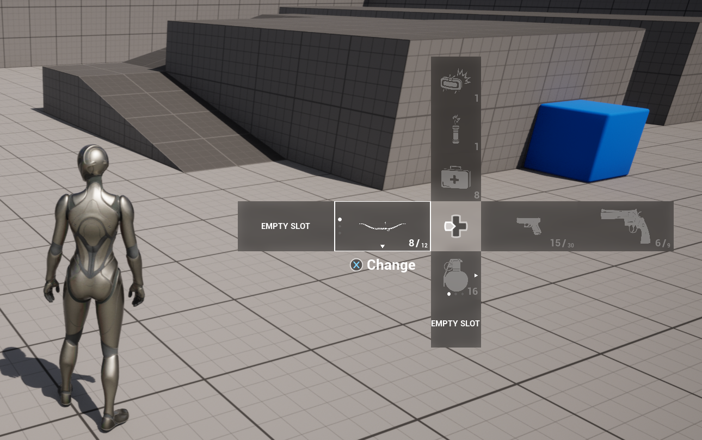

# Flexible Directional Menu

A modular, data-driven, AAA-style directional selection menu system for Unreal Engine.

## Overview

Flexible Directional Menu (FDM) is a modular, data-driven, and fully extensible directional selection system designed for Unreal Engine projects. It enables developers to build complex directional menus similar to those found in modern AAA titles, while remaining fully customizable and decoupled from game logic and UI layout. The system is implemented **entirely in Blueprints** and is compatible with Unreal Engine **5.1 and above**.

FDM is designed for both single-player and multiplayer projects. **The menu system itself does not perform any network replication by default**, allowing it to be safely used in networked environments while leaving authoritative state and replication control to the game’s own logic. Developers can freely integrate FDM with replicated inventory, ability, or interaction systems as needed.

The system follows a strict separation of concerns: gameplay data defines what appears in the menu, the component controls logic and state, and widgets handle presentation only. This makes FDM suitable for production-scale projects, easy to maintain, and flexible enough to support a wide range of use cases such as inventory selection, ability wheels, tool selection interfaces.

It is designed to be:

- Unreal Engine **5.1+** compatible
- Blueprint-only, no C++ required
- Modular, data-driven architecture
- Supports gamepad, keyboard, and custom input mappings
- Easily integrates with inventory, ability, or interaction systems
- Runtime-modifiable
- Easily extendable

FDM is not a static UI template — it is a system for managing, displaying, and interacting with dynamic menu entries at runtime.

## Why / When Should I Use This System?

Use Flexible Directional Menu when you need:

- Directional equipment / ability selection (D-Pad style)
- Data-driven UI placement instead of hardcoded UI layouts

Do NOT use FDM if:

- You only need a static inventory grid
- You want a mouse-driven drag & drop inventory