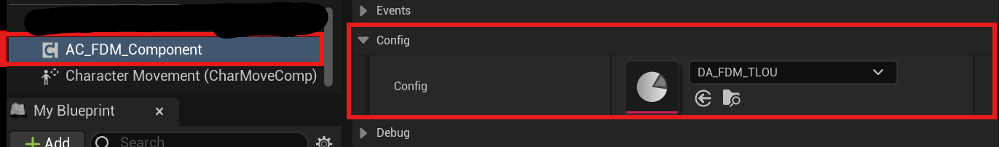
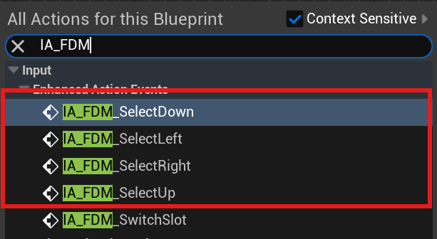
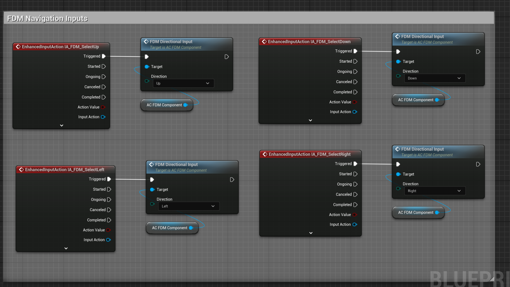
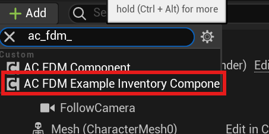
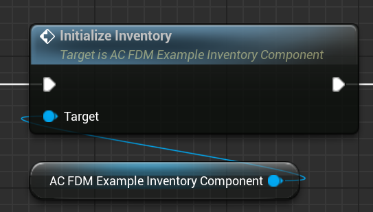
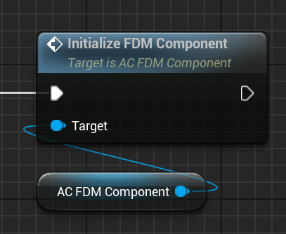
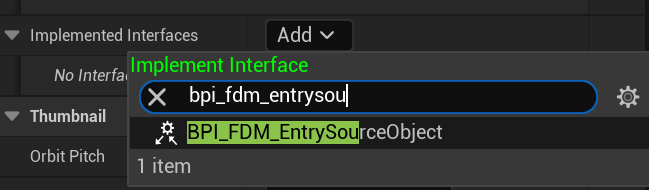
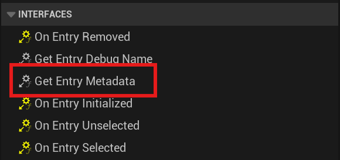
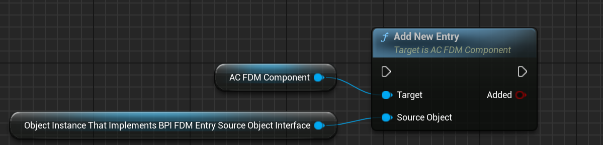

After you added the asset package to your project, follow these steps to make it work:

### 1. Add AC_FDM_Component

Add `AC_FDM_Component` to your **Player Character** or **Player Controller**.

### 2. Assign a Config asset

Assign a Config asset for the component.

### 3. Add Input Actions

Add the following input actions:

- `IA_FDM_SelectDown`
- `IA_FDM_SelectLeft`
- `IA_FDM_SelectRight`
- `IA_FDM_SelectUp`

Then call FDM Directional Input function on Triggered Event with corresponding direction input.

| Input Action | Function |
|-------------|----------|
| IA_FDM_SelectUp | FDM Directional Input (Up) |
| IA_FDM_SelectDown | FDM Directional Input (Down) |
| IA_FDM_SelectLeft | FDM Directional Input (Left) |
| IA_FDM_SelectRight | FDM Directional Input (Right) |

### 4. Optional: Example Inventory

Add `AC_FDM_ExampleInventoryComponent` and assign a starting item asset.

Then initialize the inventory on Begin Play.

### 5. Initialize the FDM Component

Call **Initialize FDM Component** when your character/controller is ready (typically on Begin Play).

### 6. Use your own system

Open the blueprint of the object (must derive from `UObject`) and implement the `BPI_FDM_EntrySourceObject` interface.

The most important function is `Get Entry Metadata`.

### 7. Add entries

Add entries by using the **Add New Entry** function.

